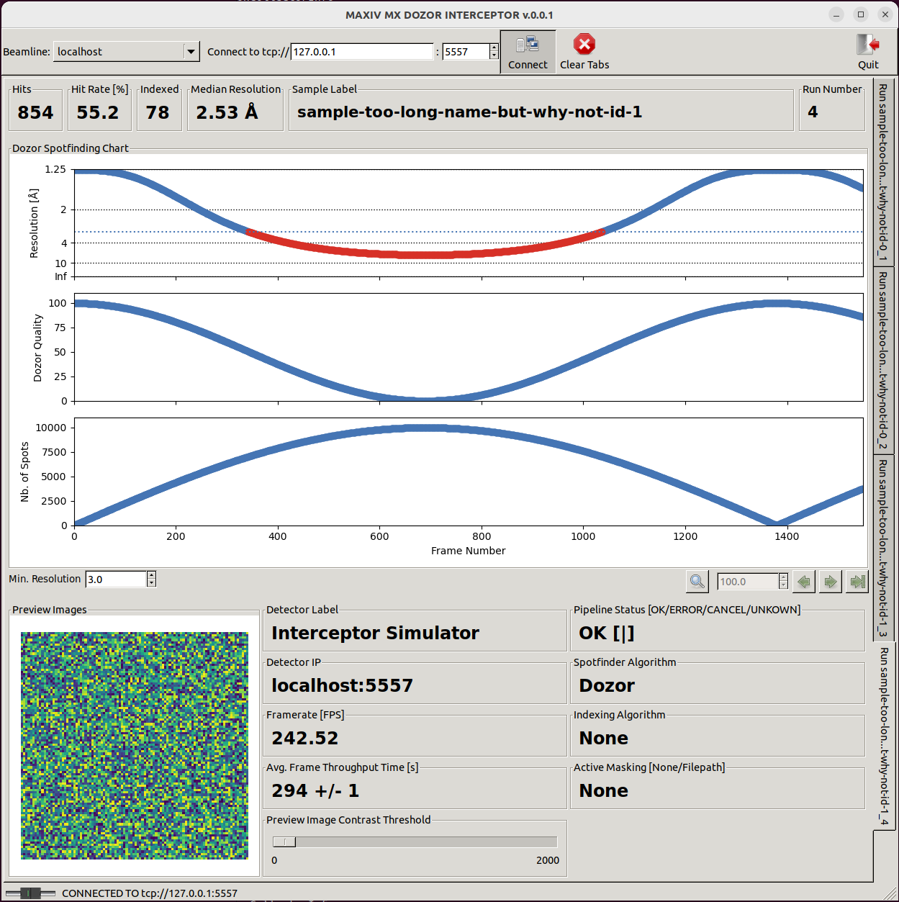

# Interceptor: Experimental Fork

## Fork Description

This is an Interceptor,  https://github.com/ssrl-px/interceptor,  fork for experimental 
modifications. The purpose is to adapt the code for Max IV,  www.maxiv.lu.se, purposes. 

In this project, the GUI part has been isolated and adapted to present Dozor spotfinding quality metrics. 
Much has been removed from the original code, and this repository is much easier to install in a Conda 
environment. There are no more depencies on DIALS. The simulator/ directory contains a python script 
that can be used to feed the GUI with fake test data for standalone evaluation and debugging. 

Some notes on the code:

- GUI modified for Dozor spotfinding metrics (number of spots, quality, and resolution)
- The update frequency of the graphics is intentionally set at 1 Hz (configurable). From what I 
undertand the ZMQ data collection loop is done in a separate thread as the GUI, but they still work within 
the limitation of the Python GIL (I'm guessing). It is therefore important to avoid starving the execution 
with excessive GUI updates. TODO list below discusses solutions to this issue.
- If a run tab collects large amount of points, the plot will only show the last 25k points in a moving 
windows. This is configurable.
- The hitrate and thresholding can be done on either quality or resolution metrics. Use the "hve (resolution)" 
and "hve (quality)" beamline tabs to evaluate this.
- There is a callback function implemented triggered by clicking a point in the first subplot. This could 
be used to view image details in an external program. The ADXV viewer, 
https://www.scripps.edu/tainer/arvai/adxv/adxv_1.9.10/AdxvUserManual_v1.1.pdf , fits this use-case. The 
manual describes a socket interface, which is a way to integrate a viewer already well-known to users.
- In some scenarios many tabs can be created. The "Clear Tabs" button removes all but the active tab.

aleksander.cehovin@maxiv.lu.se

# Example Images

Example from datacollection at Biomax Max IV by Monika Bjelcic

# Installing the decoupled GUI

Preliminary notes on simplified install of decoupled GUI

- Install miniconda with python 3.
- I have been using the conda-forge channel for my installations:
> conda config --add channels conda-forge

> conda config --set channel-priority strict

- Create a conda environment, "interceptor_gui", for the install
> conda create --name interceptor_gui python=3.7
- Activate the clean environment
> conda activate interceptor_gui
- To speed-up the installation install the following packages with conda:
> conda install ipython

> conda install wxpython

> conda install matplotlib

- I believe these can be installed with pip too, but downloading conda binaries is faster.
- Finish by installing the decoupled interceptor GUI in the environment with

> python -m pip install ./interceptor

Here we assume the current directory is the root folder above the interceptor checkout one.

The interceptor GUI is now available as "intxr.gui"

## Simple vs Extended GUI

There are now two GUI versions available. The simple one,

> intxr.gui

and the extended one

> intxr.extended_gui

Both work on any data source. The extended GUI relies on ZMQ subscription to additional channels.
This means, that extended data is optional. The simpler GUI simply do not subscribe to this additional
information and can run as before. The extended GUI is useful as a development tool to monitor what 
is happending to more complicated pipelines. Pipeline development has been moving to long-running execution
with the possibility to reconfigure parameters under runtime by sending control commands. It is in 
this scenario the additional information in the extended GUI becomes useful. 

The graphs below try to visualize the differences. Simple GUI is only collecting the "gui" ZMQ PUB topic.

In the extended case, the simulator generates two topics, "gui" and "status". A third channel "preview" is on the TODO list. The GUI subscribes to the two working channels. The preview images in the current version of the GUI are mockups internally generated by the GUI itself. Interceptor generates an internal event at the lowest application level regularly, and then creates a random matrix for plotting. This mechanism should be replaced by connecting to the future PUB_preview_todo.

## Simulator

There is a simulation folder where two simple scripts can be used to generate and test the data-stream 
the interceptor GUI relies upon as data input.

### Simulation Data Examples

Test data with GUI using quality for hit rate calculations

Test data with GUI using resolution for hit rate calculations

#### Extended GUI

Test data with the new extended GUI using resolutin for hit rate calculations

## TODO

- Datacollection seems to be done in a separate thread. The GUI manages to process 
  ZMQ updates from a pipeline of up to around 1kHz in tests, bit it is clearly a bit overloaded. 
  At some point one should make the reception better, either by batching data to decrease
  the interrupt frequency on the GUI side, or somehow increase capacity on the GUI side. 
  Not sure if more GUI threads will work here due to the Python GIL lock, maybe a multi-process
  route is needed. If this second route is tried, we will no longer have a common address
  space, so data will have to be shuffled between processes with queueus? Is there already
  some support for this in the wxwidgets library? For now, this is not a problem, but
  will have to be sorted out when moving above 1 kHz frequencies. Maybe just batching data
  on the pipeline side is the best solution. Doing it on the GUI side will implement logic
  more easily implemented upstream. 
- When actively resizing window with mouse drag, the tab switching between runs does not work properly.
- Refactor the setup of all the GUI strings.
- Add support for preview images in the extended GUI in the simulator.
- Use a proper test screen image for when preview images are not available?
